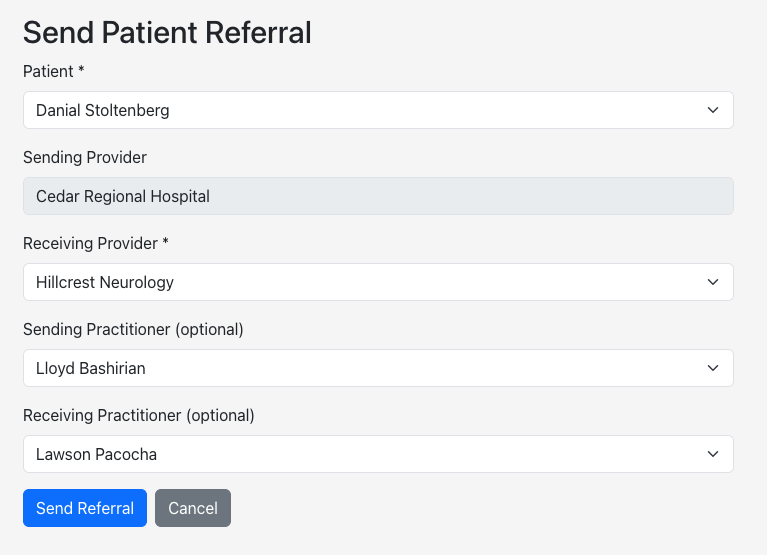
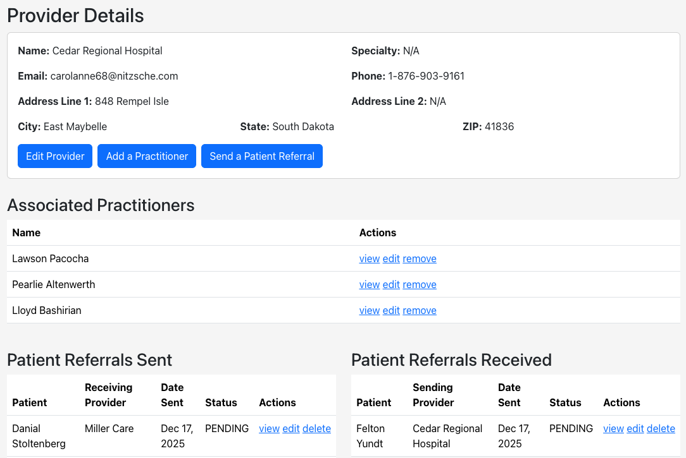
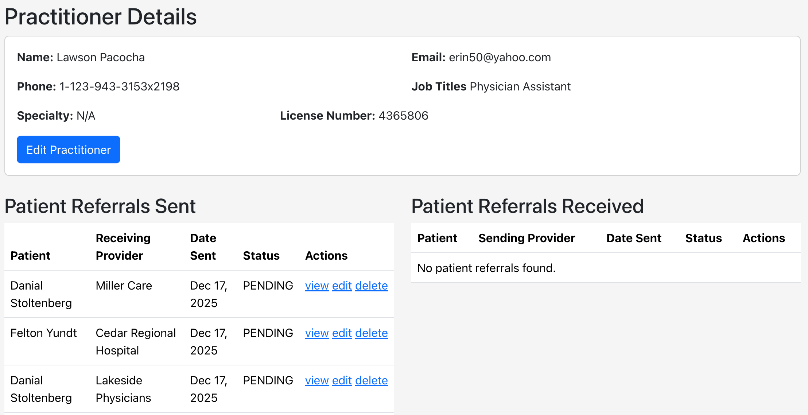
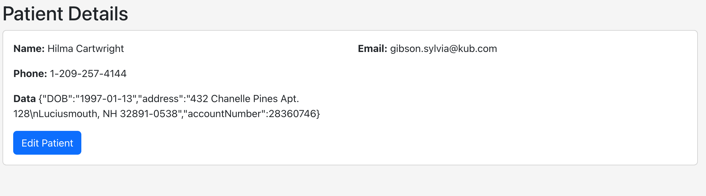
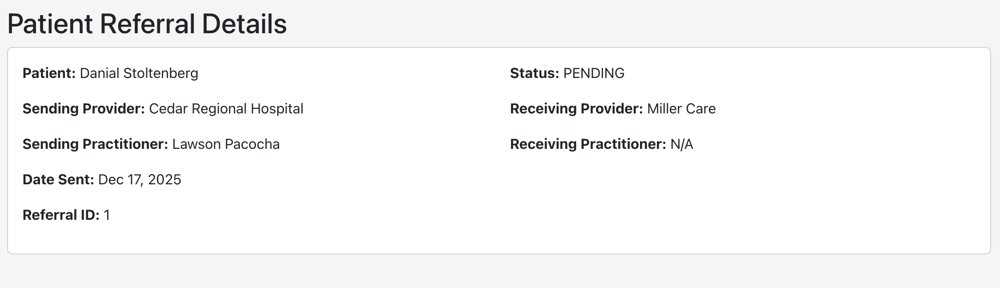
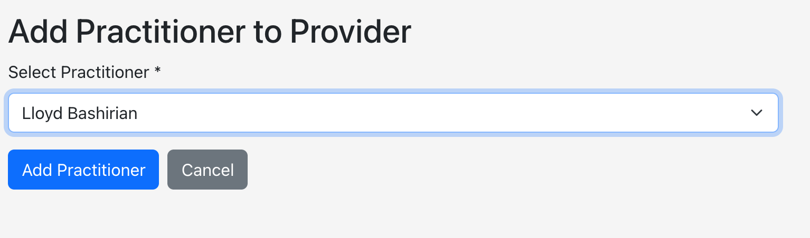
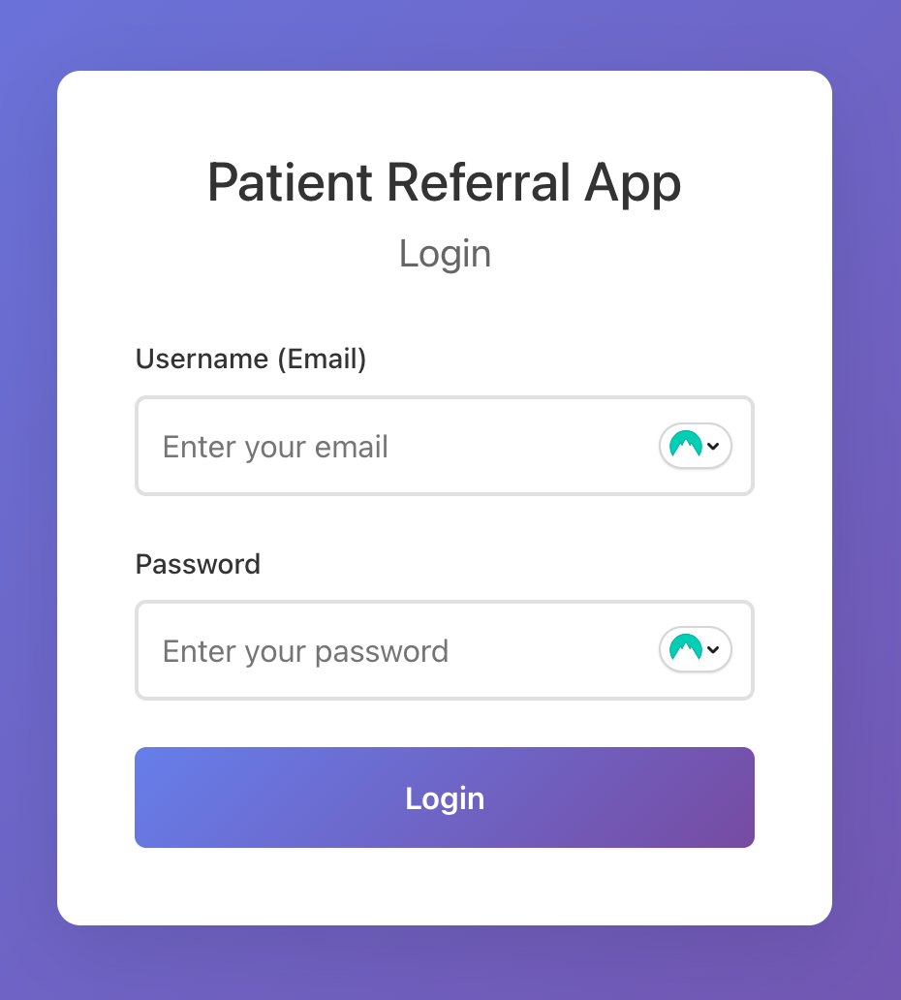

# Patient Referral App - Frontend

React frontend application for the [Patient Referral App](https://github.com/NickMichaels/patient-referral-app). Instead of scribbled down phone numbers from a PCP putting all of the onus on the patient to take next steps, healthcare providers can send patient referrals directly to another provider.

<p align="center">
  
  
</p>

## Features

- Login form that authenticates with the Symfony backend API
- JWT token storage in localStorage
- Create, update and delete provider (PCP, clinic, hospital. specialist, etc.) records 
- Create, update and delete practitioner (doctors, nurses, physicians assistants, etc.) records
- Create, update and delete patient (very limited scope - just a `name` column and `data` column - which would hold their "patient record" and could later be encoded and encrypted) record
- Associate practitioners with providers
- Send a patient to another provider via a patient referral
- Modern, responsive UI

## Installation

```bash
npm install
```

## Development

Start the development server:

```bash
npm run dev
```

The app will be available at `http://localhost:3000`

## Build

Build for production:

```bash
npm run build
```

## API Endpoints

See [API Docs](https://github.com/NickMichaels/patient-referral-app/blob/main/docs/api_documentation.md) for more info

- `POST /api/login_check` - Login endpoint (username and password)

- `GET /api/providers` - Get all providers (requires JWT token in Authorization header, as do all endpoints that follow)
- `POST/GET/PATCH/DELETE /api/providers/{id}` - Create, get, update or delete one provider

- `GET /api/practitioners` - Get all practitioners
- `POST/GET/PATCH/DELETE /api/practitioners/{id}` - Create, get, update or delete one practitioner

- `GET /api/patients` - Get all patients
- `POST/GET/PATCH/DELETE /api/patients/{id}` - Create, get, update or delete one patient

- `GET api/providers/{id}/practitioners` - Get all associated practitioners for a provider
- `POST api/providers/{id}/add_practitioner` - Add a practitioner to a provider
- `POST api/providers/{id}/remove_practitioner` - Remove a practitioner from a provider

- `POST api/providers/{id}/send_referral` - Send a patient referral to another provider
- `GET api/providers/{id}/referrals_sent` - Get all patient referrals sent by a provider
- `GET api/providers/{id}/referrals_received` - Get all patient referrals received by a provider
- `GET api/practitioners/{id}/referrals_sent` - Get all patient referrals sent by a practitioner
- `GET api/practitioners/{id}/referrals_received` - Get all patient referrals received by a practitioner
- `GET/PATCH/DELETE api/patientreferrals/{id}` - Get, update or delete one patient referral

## More Screenshots

<p align="center">
  
</p>
<p align="center">
  
  
</p>
<p align="center">
  
</p>
<p align="center">
  
</p>


## Authentication

The app stores the JWT token in localStorage after successful login. The token is automatically included in API requests to protected endpoints.

